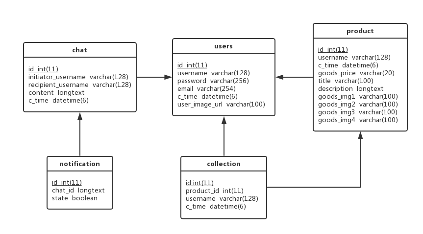

# 概念模型

# 表结构

1.表名：users

|字段名          |数据类型      |默认值    |允许非空 |自动递增  |说明           |
|---------------|--------------|---------|--------|----------|---------------|
|id             |int(11)       |         |no       |yes      |用户id，主键   |
|username       |varchar(128)  |         |no       |         |用户名，唯一   |
|password       |varchar(256)  |         |no       |         |密码           |
|email          |varchar(254)  |         |no       |         |邮箱，唯一     |
|c_time         |datetime(6)   |         |         |         |注册时间       |
|user_image_url |varchar(100)  |         |yes      |         |用户头像链接   |

2.表名:product

|字段名          |数据类型      |默认值    |允许非空 |自动递增 |说明                                   |
|---------------|--------------|---------|--------|---------|--------------------------------------|
|id             |int(11)       |         |no       |yes     |id，主键                               |
|username       |varchar(128)  |         |no       |        |发布交易信息的用户名，->users(username)  |
|c_time         |datetime(6)   |         |         |        |写入数据库时间                          |
|goods_price    |varchar(20)   |         |         |        |商品价格                               |
|title          |varchar(100)  |         |         |        |交易信息标题                           |
|description    |longtext      |         |         |        |交易信息描述                           |
|goods_img1     |varchar(100)  |         |no       |        |交易信息图片1                           |
|goods_img2     |varchar(100)  |         |yes      |        |交易信息图片2                           |
|goods_img3     |varchar(100)  |         |yes      |        |交易信息图片3                           |
|goods_img4     |varchar(100)  |         |yes      |        |交易信息图片4                           |

3.表名：chat

|字段名              |数据类型      |默认值    |允许非空 |自动递增 |说明                             |
|-------------------|--------------|---------|--------|---------|--------------------------------|
|id                 |int(11)       |         |no       |yes     |id，主键                         |
|initiator_username |varchar(128)  |         |no       |        |聊天发起者用户名，->users(username) |
|recipient_username |varchar(128)  |         |no       |        |聊天接收者用户名，->users(username) |
|content            |longtext      |         |         |        |聊天内容                          |
|c_time             |datetime(6)   |         |         |        |时间                              |

4.表名：notification

|字段名              |数据类型      |默认值    |允许非空 |自动递增 |说明                             |
|-------------------|--------------|---------|--------|---------|--------------------------------|
|id                 |int(11)       |         |no       |yes     |id，主键                         |
|chat_id            |longtext      |         |         |        |->chat(id)                       |
|state              |boolean       |0        |         |        |阅读状态                          |

5.表名：collection

|字段名           |数据类型      |默认值    |允许非空 |自动递增 |说明                             |
|----------------|--------------|---------|--------|---------|--------------------------------|
|id              |int(11)       |         |no       |yes     |id，主键                         |
|product_id      |int(11)       |         |no       |        |商品id，->product(id)            |
|username        |varchar(128)  |         |no       |        |用户名，->users(username)        |   
|c_time          |datetime(6)   |         |         |        |收藏时间                         |   

6.表名：token

|字段名           |数据类型      |默认值    |允许非空 |自动递增 |说明                             |
|----------------|--------------|---------|--------|---------|--------------------------------|
|key             |varchar(40)   |         |no      |         |用户权限令牌                     |
|created         |datetime(6)   |         |        |         |token创建的时间                  |
|user_id         |int(11)       |         |        |         |token对应用户的id，->users(id)   |

