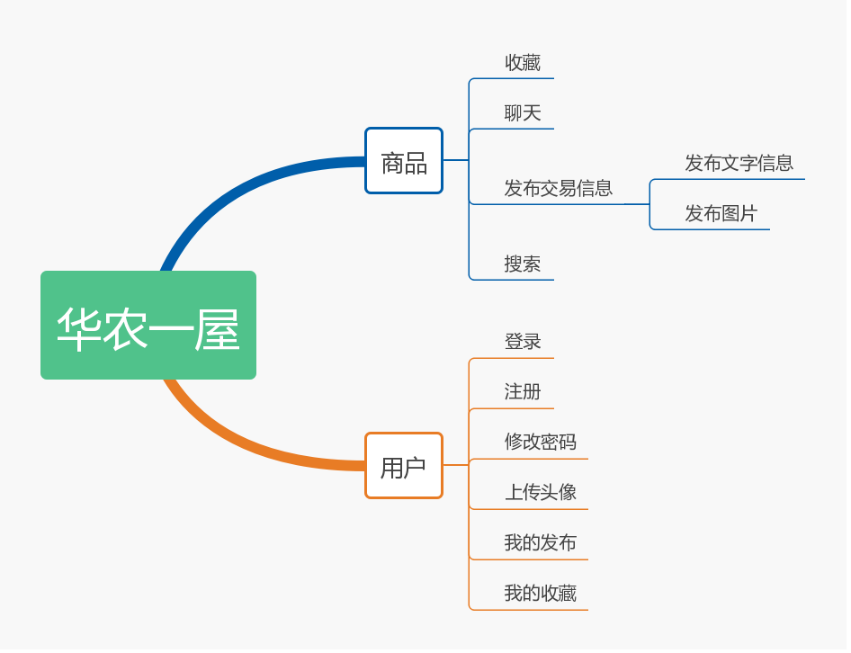

# 引言

## 编写目的

大概阐述这个项目的结构和功能。

这个系统是类似于闲鱼的二手交易平台，卖家可以在平台上挂出商品消息，买家从平台上找到自己想想要的物件，并与卖家进行交易。这个项目不会做的特别精细，只实现前台功能模块，完成一个二手交易应用最重要的功能部分即可。

## 背景

软件系统名称：华农一屋

系统类型：二手交易应用

任务提出者：凡沸

开发者：凡沸

用户：华农在校师生

协议：MIT

## 用户特点

该应用主要面向在校大学生，该类群体与互联网关系十分密切，熟悉与互联网相关应用的操作。

该应用的操作和维护人员是本校的在读计算机系学生，技术专长在前端领域，能完成逻辑较简单的后端代码。

因为本应用的使用群体主要是本校学生，根据我校一些二手交易群和已经在用的二手交易应用的使用情况来看，预计本应用的使用频率还行。

# 功能需求

## 系统范围

本应用的开发目的是解决大学生处理闲置物品难的问题，并为同学们购买二手物品提供平台。

## 系统功能结构

系统的功能可以分为两大模块，一个是商品模块，一个是用户模块。商品模块主要负责与商品相关的功能，例如收藏某条商品信息、发布商品信息、与卖家聊天和搜索商品信息。用户模块负责与用户相关的功能，例如登录、注册、修改密码、上传头像、查看自己已经发布的交易信息和查看自己收藏的交易信息。

## 系统整体流程

买家在注册、登录应用后可在首页浏览商品信息，或在搜索栏里查找自己想要的商品。点击商品信息，可进入商品详情界面，在商品详情界面，买家可以看到关于商品的一些信息，并可以对这条信息进行收藏，或与卖家进行联系。同时，买家可以在个人中心修改账户密码、上传头像或者查看已收藏的商品信息。

卖家可以发布关于商品的信息和图片。

## 需求分析

### 登录

当用户点开应用以后，首先进入的是登录界面。用户需要输入账户和密码，并点击提交。如果账户密码正确，用户将进入首页界面，否则系统对用户进行 提示。用户只有在登录以后才可以访问除登录注册界面以外的其他界面。

### 注册

用户需要在注册界面提交账号、密码和邮箱。系统对用户提交的信息进行判定，如果账号或者邮箱已被注册，那么系统会对用户进行相应的提示。如果用户提交的信息无误，系统会向注册的邮箱发送验证邮件，如果验证成功，则注册成功。

### 修改密码

用户提交新密码，系统对新密码进行简单验证后，将新密码从新写入数据库，并要求用户重新登录。

### 上传头像

用户提交需要上传的图片，系统对图片进行规格上的判定，如图片符合要求，那么系统将图片上传至服务器，并将图片地址写入数据库。

### 我的收藏

系统从数据库中读取相应用户的收藏信息，并在界面展示。

### 我的发布

系统从数据库中读取相应用户的发布信息，并在界面展示。

### 收藏

当用户点击收藏按钮后，该条商品信息将放入用户的收藏队列。

### 聊天

买家和卖价实时聊天

### 发布交易信息

用户可以提交关于商品的文字信息和图片，系统将图片上传至服务器后，将图片地址和文字信息存入数据库。

### 搜索

系统将用户提交的关键词在商品信息列表中进行搜索，并在界面展示搜索结果。

### 数据词典

1.登录界面

|数据    |类型      |长度       |说明                 |
|-------|----------|-----------|----------------------|
|账号    |字符串    |不超过20位  |一个用户只有一个账号  |
|密码    |字符串    |不超过20位  |                    |

2.注册界面

|数据        |类型      |长度       |说明                 |
|------------|----------|----------|----------------------|
|账号        |字符串    |不超过20位  |一个用户只有一个账号  |
|密码        |字符串    |不超过20位  |                    |
|再次输入密码 |字符串    |不超过20位  |两次密码要一致       |
|验证邮箱     |字符串    |           |要符合邮箱格式       |

3.商品详情界面

|数据        |类型      |长度        |说明                 |
|------------|----------|-----------|----------------------|
|标题        |字符串     |不超过20位  |                     |
|商品描述    |文本       |不超过300位 |                     |
|价格        |浮点数     |不超过10位  |                     |
|图片        |图片       |           |最多有4张            |

4.我的收藏界面

|数据        |类型      |长度        |说明                 |
|------------|----------|-----------|----------------------|
|标题        |字符串     |不超过20位  |                     |
|价格        |浮点数     |不超过10位  |                     |
|图片        |图片       |           |只展示1张            |

5.我的发布界面

|数据        |类型      |长度        |说明                 |
|------------|----------|-----------|----------------------|
|标题        |字符串     |不超过20位  |                     |
|价格        |浮点数     |不超过10位  |                     |
|图片        |图片       |           |只展示1张            |

6.发布界面

|数据        |类型      |长度        |说明                 |
|------------|----------|-----------|----------------------|
|标题        |字符串     |不超过20位  |                     |
|商品描述    |文本       |不超过300位 |                     |
|价格        |浮点数     |不超过10位  |                     |
|图片        |图片       |           |最多有4张            |

# 运行环境规定

## 支持软件

操作系统平台：Linux、Windows、Android、ISO

数据库系统平台：MySQL

编译工具：PyCharm

测试软件：postman

